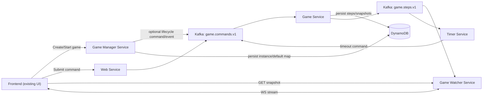

# Cow Boy V2 Design

## 1. Scope
Version 2 keeps the current frontend visual design and moves game processing to a client/server architecture.

Key requirements:
- Backend in Rust.
- No auth in V2.
- Kafka MQ for command/event transport.
- DynamoDB persistence for game creation and every processed command step.
- Watcher sync uses `turn_no` (with strict assumptions).

## 2. High-Level Architecture



## 3. Services

## 3.1 Game Manager Service
Responsibilities:
- Create game instances.
- Start game instances.
- Manage default map lifecycle.

Create game modes:
1. With map provided in request.
2. Without map:
- Use stored default map.
- If default map does not exist, generate random default map once and store it.

Start game:
- `POST /v2/games/{game_id}/start` moves game from `CREATED` to `RUNNING`.
- Must cause a `GAME_STARTED` event to be broadcast to websocket clients.
- Must ensure latest snapshot endpoint returns started game state immediately.

## 3.2 Web Service
Responsibilities:
- Receive frontend commands.
- Validate request shape.
- Publish command to Kafka `game.commands.v1`.

No game-rule validation here.

## 3.3 Game Service
Responsibilities:
- Consume `game.commands.v1`.
- Validate command against current game rules/state.
- Apply state transition when valid.
- Own game-finish transition when only one alive player remains.
- Persist one step record per consumed command in DynamoDB.
- Publish step result/state event to `game.steps.v1`.

Important:
- Late commands after timeout are ignored and persisted as ignored records.
- Invalid commands are persisted as invalid records.
- When a valid command leaves exactly one alive player, Game Service must mark the game `FINISHED`.

## 3.4 Timer Service
Responsibilities:
- Enforce per-turn timeout (default 10s, configurable by game).
- When a turn starts, schedule timer for expected player + turn.
- If time expires, publish `timeout` command into `game.commands.v1`.
- Reset timer for next turn.

Late command behavior:
- If player submits after timeout for that turn, Game Service records as ignored timeout.

## 3.5 Game Watcher Service
Interfaces:
1. Latest snapshot API:
- Returns latest map + players state + current turn metadata.
2. WebSocket stream API:
- Client connects with `from_turn_no`.
- Service pushes valid state-changing events for turns after `from_turn_no`.

Additionally:
- Broadcast `GAME_STARTED` event to connected clients when game starts.
- Broadcast `GAME_FINISHED` event to connected clients when game ends.

## 4. Turn Cursor Model

V2 watcher cursor uses `turn_no`, not `position`.

Strict assumptions required:
1. Exactly one valid applied step per `turn_no` per `game_id`.
2. `turn_no` increases only when turn is consumed.
3. Invalid/ignored records never consume turn and are not streamed as valid steps.
4. History is immutable and ordered.
5. Single logical writer for transitions per game (Game Service).

`position` may still exist internally in persistence for audit ordering.

## 5. Persistence Model (DynamoDB)

## 5.1 Table: `default_maps`
Purpose:
- Store reusable default map.

Keys:
- PK: `default_key` (string), use `ACTIVE`

Attributes:
- `map`
- `created_at`
- `updated_at`
- `generator_version`

## 5.2 Table: `game_instances`
Purpose:
- Store every created game instance and initial configuration.

Keys:
- PK: `game_id` (string)

Attributes:
- `status` (`CREATED` | `RUNNING` | `FINISHED`)
- `map_source` (`CUSTOM` | `DEFAULT`)
- `map`
- `turn_timeout_seconds`
- `current_turn_no`
- `current_round_no`
- `current_player_id`
- `created_at`
- `started_at` (optional)
- `finished_at` (optional)

## 5.3 Table: `game_steps`
Purpose:
- Audit trail of every consumed command and result.

Keys:
- PK: `game_id` (string)
- SK: `step_seq` (number, monotonic internal sequence)

Attributes:
- `turn_no`
- `round_no`
- `command_id`
- `source` (`USER` | `TIMER` | `SYSTEM`)
- `command_type` (`move` | `shield` | `shoot` | `timeout` | `game_started`)
- `player_id`
- `direction`
- `result_status`
- `result_reason`
- `state_after` (snapshot after processing this step)
- `created_at`

Recommended GSI:
- `command_id-index` for dedupe/idempotency lookup.

## 6. Kafka Contracts

## 6.1 Topic: `game.commands.v1`
Produced by:
- Web Service (user commands)
- Timer Service (timeout command)
- Game Manager Service or Game Service bootstrap path (`game_started` command/event)

Consumed by:
- Game Service

Partition key:
- `game_id`

Example:
```json
{
  "command_id": "uuid",
  "source": "USER",
  "game_id": "01H...",
  "player_id": "left",
  "command_type": "shoot",
  "direction": "up",
  "turn_no": 12,
  "sent_at": "2026-02-09T10:00:00Z"
}
```

## 6.2 Topic: `game.steps.v1`
Produced by:
- Game Service

Consumed by:
- Game Watcher Service
- Timer Service

Example:
```json
{
  "game_id": "01H...",
  "step_seq": 88,
  "turn_no": 12,
  "round_no": 4,
  "event_type": "STEP_APPLIED",
  "result_status": "APPLIED",
  "command": {
    "command_id": "uuid",
    "player_id": "left",
    "command_type": "shoot",
    "direction": "up"
  },
  "state_after": {},
  "created_at": "2026-02-09T10:00:01Z"
}
```

`GAME_STARTED` event example:
```json
{
  "game_id": "01H...",
  "step_seq": 1,
  "turn_no": 0,
  "round_no": 1,
  "event_type": "GAME_STARTED",
  "result_status": "APPLIED",
  "state_after": {},
  "created_at": "2026-02-09T10:00:00Z"
}
```

## 7. HTTP API Contracts

## 7.1 Game Manager Service

### POST `/v2/games`
Create game instance.

Request (with map):
```json
{
  "turn_timeout_seconds": 10,
  "map": {
    "rows": 11,
    "cols": 11,
    "cells": [[0,0,0],[0,-1,1],[0,0,0]]
  }
}
```

Request (without map):
```json
{
  "turn_timeout_seconds": 10
}
```

Response:
```json
{
  "game_id": "01H...",
  "status": "CREATED",
  "map_source": "CUSTOM",
  "turn_no": 1,
  "round_no": 1,
  "current_player_id": "up",
  "created_at": "2026-02-09T10:00:00Z"
}
```

### POST `/v2/games/{game_id}/start`
Start game and trigger websocket `GAME_STARTED` event.

Request:
```json
{}
```

Response:
```json
{
  "game_id": "01H...",
  "status": "RUNNING",
  "started": true,
  "turn_no": 1,
  "round_no": 1,
  "current_player_id": "up",
  "started_at": "2026-02-09T10:05:00Z"
}
```

Idempotent already-running response:
```json
{
  "game_id": "01H...",
  "status": "RUNNING",
  "started": false,
  "reason": "ALREADY_RUNNING"
}
```

### GET `/v2/games/{game_id}`
Get game metadata from `game_instances`.

### GET `/v2/maps/default`
Get current default map.

## 7.2 Web Service

### POST `/v2/games/{game_id}/commands`
Accept command and enqueue to Kafka.

Request:
```json
{
  "command_id": "uuid",
  "player_id": "up",
  "command_type": "move",
  "direction": "left",
  "turn_no": 7,
  "client_sent_at": "2026-02-09T10:06:00Z"
}
```

Response:
```json
{
  "accepted": true,
  "command_id": "uuid",
  "queued_at": "2026-02-09T10:06:00Z"
}
```

Current implementation note:
- Web Service forwards command processing to Game Service (`/internal/v2/games/{game_id}/commands/process`) before Kafka integration is finalized.

## 7.3 Game Service (Internal)

### POST `/internal/v2/games/{game_id}/commands/process`
Process one command and return updated turn/state metadata.

Response:
```json
{
  "accepted": true,
  "applied": true,
  "reason": null,
  "turn_no": 8,
  "round_no": 3,
  "current_player_id": "left",
  "status": "RUNNING"
}
```

Behavior:
- Calls manager apply endpoint.
- If command applied and one alive player remains, calls manager finish endpoint.
- Returns final status (`RUNNING` or `FINISHED`) after processing.

## 7.4 Game Watcher Service

### GET `/v2/games/{game_id}/snapshot?from_turn_no={turn_no}`
Return latest game state snapshot.

Response:
```json
{
  "game_id": "01H...",
  "status": "RUNNING",
  "turn_no": 7,
  "round_no": 2,
  "current_player_id": "down",
  "state": {
    "map": {},
    "players": []
  },
  "last_step_seq": 56
}
```

### GET WebSocket `/v2/games/{game_id}/stream?from_turn_no=6`
Stream valid applied events for turns after `from_turn_no`.

Events:
- `GAME_STARTED`
- `GAME_FINISHED`
- `SNAPSHOT`

Event payload:
```json
{
  "event_type": "STEP_APPLIED",
  "game_id": "01H...",
  "turn_no": 7,
  "round_no": 2,
  "current_player_id": "down",
  "command": {},
  "state_after": {},
  "created_at": "2026-02-09T10:06:01Z"
}
```

## 8. Result Status

Allowed values:
- `APPLIED`
- `TIMEOUT_APPLIED`
- `IGNORED_TIMEOUT`
- `INVALID_COMMAND`
- `INVALID_TURN`
- `DUPLICATE_COMMAND`

Watcher valid stream includes only:
- `APPLIED`
- `TIMEOUT_APPLIED`
- `GAME_STARTED` lifecycle event
- `GAME_FINISHED` lifecycle event

## 9. Core Processing Rules

1. No auth checks in V2.
2. Player has one action per turn.
3. Timer default 10s, configurable per game.
4. Timeout publishes `timeout` command; late user command for expired turn is ignored and persisted.
5. Every consumed command is persisted into `game_steps`.
6. `start` API must trigger websocket start event and snapshot must immediately reflect started game state.
7. Game must transition to `FINISHED` as soon as one alive player remains, and watcher must publish `GAME_FINISHED`.

## 10. Implementation Notes (Rust)

Suggested crates:
- `axum` for HTTP + WebSocket
- `rdkafka` for Kafka
- `aws-sdk-dynamodb` for DynamoDB
- `serde`/`serde_json` for contracts
- `tokio` runtime

Suggested deployment:
- One binary per service (or one workspace with multiple bins).
- Kafka consumer group separation:
  - `game-service-group`
  - `watcher-service-group`
  - `timer-service-group`
