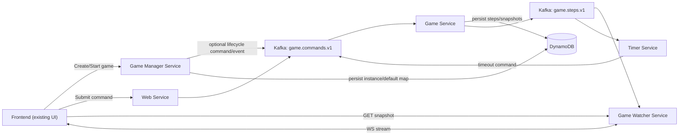

# Cow Boy V2 设计文档

## 1. 范围

V2 版本保留当前前端视觉设计，并将游戏处理迁移到客户端/服务器架构。

关键需求：
- 后端使用 Rust。
- V2 不包含身份验证。
- 使用 Kafka MQ 进行命令/事件传输。
- 使用 DynamoDB 持久化游戏创建和每个已处理的命令步骤。
- Watcher 同步使用 `turn_no`（有严格假设条件）。

## 2. 高层架构



## 3. 服务

## 3.1 Game Manager Service
职责：
- 创建游戏实例。
- 启动游戏实例。
- 管理默认地图生命周期。

创建游戏模式：
1. 请求中提供地图。
2. 不提供地图：
- 使用已存储的默认地图。
- 如果默认地图不存在，生成随机默认地图并存储。

启动游戏：
- `POST /v2/games/{game_id}/start` 将游戏从 `CREATED` 状态迁移到 `RUNNING` 状态。
- 必须触发 `GAME_STARTED` 事件广播给 WebSocket 客户端。
- 必须确保最新快照端点立即返回已启动的游戏状态。

## 3.2 Web Service
职责：
- 接收前端命令。
- 验证请求格式。
- 将命令发布到 Kafka `game.commands.v1`。

此处不进行游戏规则验证。

## 3.3 Game Service
职责：
- 消费 `game.commands.v1`。
- 根据当前游戏规则/状态验证命令。
- 验证通过时应用状态转换。
- 当仅剩一名存活玩家时，负责游戏结束状态转换。
- 每个消费的命令在 DynamoDB 中持久化一条步骤记录。
- 将步骤结果/状态事件发布到 `game.steps.v1`。

重要说明：
- 超时后的迟到命令将被忽略并作为忽略记录持久化。
- 无效命令作为无效记录持久化。
- 当一个有效命令导致仅剩一名存活玩家时，Game Service 必须将游戏标记为 `FINISHED`。

## 3.4 Timer Service
职责：
- 强制执行每回合超时（默认 10 秒，可按游戏配置）。
- 当回合开始时，为预期的玩家 + 回合调度计时器。
- 如果时间到期，将 `timeout` 命令发布到 `game.commands.v1`。
- 为下一回合重置计时器。

迟到命令行为：
- 如果玩家在该回合超时后提交命令，Game Service 将其记录为忽略的超时。

## 3.5 Game Watcher Service
接口：
1. 最新快照 API：
- 返回最新的地图 + 玩家状态 + 当前回合元数据。
2. WebSocket 流 API：
- 客户端使用 `from_turn_no` 连接。
- 服务推送 `from_turn_no` 之后的有效状态变更事件。

补充说明：
- 当游戏开始时，向已连接的客户端广播 `GAME_STARTED` 事件。
- 当游戏结束时，向已连接的客户端广播 `GAME_FINISHED` 事件。

## 4. 回合游标模型

V2 watcher 游标使用 `turn_no`，而非 `position`。

严格假设条件：
1. 每个 `game_id` 的每个 `turn_no` 恰好有一个有效的已应用步骤。
2. `turn_no` 仅在回合被消费时递增。
3. 无效/忽略的记录不消费回合，也不会作为有效步骤流式传输。
4. 历史记录不可变且有序。
5. 每个游戏只有一个逻辑写入者负责状态转换（Game Service）。

`position` 可能仍在内部持久化中存在，用于审计排序。

## 5. 持久化模型（DynamoDB）

## 5.1 表：`default_maps`
用途：
- 存储可复用的默认地图。

键：
- PK：`default_key`（字符串），使用 `ACTIVE`

属性：
- `map`
- `created_at`
- `updated_at`
- `generator_version`

## 5.2 表：`game_instances`
用途：
- 存储每个已创建的游戏实例及其初始配置。

键：
- PK：`game_id`（字符串）

属性：
- `status`（`CREATED` | `RUNNING` | `FINISHED`）
- `map_source`（`CUSTOM` | `DEFAULT`）
- `map`
- `turn_timeout_seconds`
- `current_turn_no`
- `current_round_no`
- `current_player_id`
- `created_at`
- `started_at`（可选）
- `finished_at`（可选）

## 5.3 表：`game_steps`
用途：
- 每个已消费命令及其结果的审计记录。

键：
- PK：`game_id`（字符串）
- SK：`step_seq`（数字，单调递增的内部序列号）

属性：
- `turn_no`
- `round_no`
- `command_id`
- `source`（`USER` | `TIMER` | `SYSTEM`）
- `command_type`（`move` | `shield` | `shoot` | `timeout` | `game_started`）
- `player_id`
- `direction`
- `result_status`
- `result_reason`
- `state_after`（处理此步骤后的快照）
- `created_at`

推荐的 GSI：
- `command_id-index` 用于去重/幂等性查询。

## 6. Kafka 契约

## 6.1 Topic：`game.commands.v1`
生产者：
- Web Service（用户命令）
- Timer Service（超时命令）
- Game Manager Service 或 Game Service 引导路径（`game_started` 命令/事件）

消费者：
- Game Service

分区键：
- `game_id`

示例：
```json
{
  "command_id": "uuid",
  "source": "USER",
  "game_id": "01H...",
  "player_id": "left",
  "command_type": "shoot",
  "direction": "up",
  "turn_no": 12,
  "sent_at": "2026-02-09T10:00:00Z"
}
```

## 6.2 Topic：`game.steps.v1`
生产者：
- Game Service

消费者：
- Game Watcher Service
- Timer Service

示例：
```json
{
  "game_id": "01H...",
  "step_seq": 88,
  "turn_no": 12,
  "round_no": 4,
  "event_type": "STEP_APPLIED",
  "result_status": "APPLIED",
  "command": {
    "command_id": "uuid",
    "player_id": "left",
    "command_type": "shoot",
    "direction": "up"
  },
  "state_after": {},
  "created_at": "2026-02-09T10:00:01Z"
}
```

`GAME_STARTED` 事件示例：
```json
{
  "game_id": "01H...",
  "step_seq": 1,
  "turn_no": 0,
  "round_no": 1,
  "event_type": "GAME_STARTED",
  "result_status": "APPLIED",
  "state_after": {},
  "created_at": "2026-02-09T10:00:00Z"
}
```

## 7. HTTP API 契约

## 7.1 Game Manager Service

### POST `/v2/games`
创建游戏实例。

请求（包含地图）：
```json
{
  "turn_timeout_seconds": 10,
  "map": {
    "rows": 11,
    "cols": 11,
    "cells": [[0,0,0],[0,-1,1],[0,0,0]]
  }
}
```

请求（不包含地图）：
```json
{
  "turn_timeout_seconds": 10
}
```

响应：
```json
{
  "game_id": "01H...",
  "status": "CREATED",
  "map_source": "CUSTOM",
  "turn_no": 1,
  "round_no": 1,
  "current_player_id": "up",
  "created_at": "2026-02-09T10:00:00Z"
}
```

### POST `/v2/games/{game_id}/start`
启动游戏并触发 WebSocket `GAME_STARTED` 事件。

请求：
```json
{}
```

响应：
```json
{
  "game_id": "01H...",
  "status": "RUNNING",
  "started": true,
  "turn_no": 1,
  "round_no": 1,
  "current_player_id": "up",
  "started_at": "2026-02-09T10:05:00Z"
}
```

幂等的已运行响应：
```json
{
  "game_id": "01H...",
  "status": "RUNNING",
  "started": false,
  "reason": "ALREADY_RUNNING"
}
```

### GET `/v2/games/{game_id}`
从 `game_instances` 获取游戏元数据。

### GET `/v2/maps/default`
获取当前默认地图。

## 7.2 Web Service

### POST `/v2/games/{game_id}/commands`
接受命令并入队到 Kafka。

请求：
```json
{
  "command_id": "uuid",
  "player_id": "up",
  "command_type": "move",
  "direction": "left",
  "turn_no": 7,
  "client_sent_at": "2026-02-09T10:06:00Z"
}
```

响应：
```json
{
  "accepted": true,
  "command_id": "uuid",
  "queued_at": "2026-02-09T10:06:00Z"
}
```

当前实现说明：
- 在 Kafka 集成最终完成之前，Web Service 将命令处理转发给 Game Service（`/internal/v2/games/{game_id}/commands/process`）。

## 7.3 Game Service（内部）

### POST `/internal/v2/games/{game_id}/commands/process`
处理一个命令并返回更新后的回合/状态元数据。

响应：
```json
{
  "accepted": true,
  "applied": true,
  "reason": null,
  "turn_no": 8,
  "round_no": 3,
  "current_player_id": "left",
  "status": "RUNNING"
}
```

行为：
- 调用管理器的 apply 端点。
- 如果命令已应用且仅剩一名存活玩家，调用管理器的 finish 端点。
- 处理后返回最终状态（`RUNNING` 或 `FINISHED`）。

## 7.4 Game Watcher Service

### GET `/v2/games/{game_id}/snapshot?from_turn_no={turn_no}`
返回最新的游戏状态快照。

响应：
```json
{
  "game_id": "01H...",
  "status": "RUNNING",
  "turn_no": 7,
  "round_no": 2,
  "current_player_id": "down",
  "state": {
    "map": {},
    "players": []
  },
  "last_step_seq": 56
}
```

### GET WebSocket `/v2/games/{game_id}/stream?from_turn_no=6`
流式传输 `from_turn_no` 之后的有效已应用事件。

事件类型：
- `GAME_STARTED`
- `GAME_FINISHED`
- `SNAPSHOT`

事件载荷：
```json
{
  "event_type": "STEP_APPLIED",
  "game_id": "01H...",
  "turn_no": 7,
  "round_no": 2,
  "current_player_id": "down",
  "command": {},
  "state_after": {},
  "created_at": "2026-02-09T10:06:01Z"
}
```

## 8. 结果状态

允许的值：
- `APPLIED`
- `TIMEOUT_APPLIED`
- `IGNORED_TIMEOUT`
- `INVALID_COMMAND`
- `INVALID_TURN`
- `DUPLICATE_COMMAND`

Watcher 有效流仅包含：
- `APPLIED`
- `TIMEOUT_APPLIED`
- `GAME_STARTED` 生命周期事件
- `GAME_FINISHED` 生命周期事件

## 9. 核心处理规则

1. V2 不进行身份验证检查。
2. 每个玩家每回合只有一次操作。
3. 计时器默认 10 秒，可按游戏配置。
4. 超时发布 `timeout` 命令；已过期回合的迟到用户命令将被忽略并持久化。
5. 每个消费的命令都持久化到 `game_steps`。
6. `start` API 必须触发 WebSocket 启动事件，快照必须立即反映已启动的游戏状态。
7. 当仅剩一名存活玩家时，游戏必须立即转换为 `FINISHED`，watcher 必须发布 `GAME_FINISHED`。

## 10. 实现说明（Rust）

建议使用的 crate：
- `axum` 用于 HTTP + WebSocket
- `rdkafka` 用于 Kafka
- `aws-sdk-dynamodb` 用于 DynamoDB
- `serde`/`serde_json` 用于契约
- `tokio` 运行时

建议的部署方式：
- 每个服务一个二进制文件（或一个 workspace 包含多个二进制文件）。
- Kafka 消费者组分离：
  - `game-service-group`
  - `watcher-service-group`
  - `timer-service-group`
